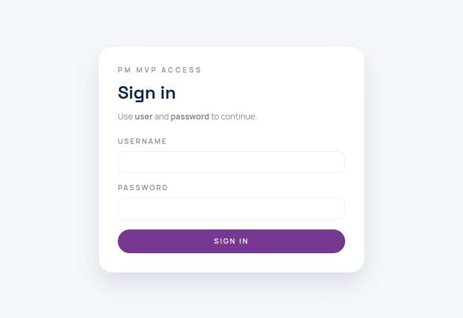
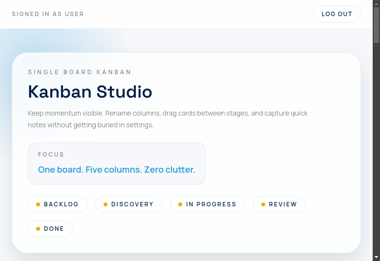
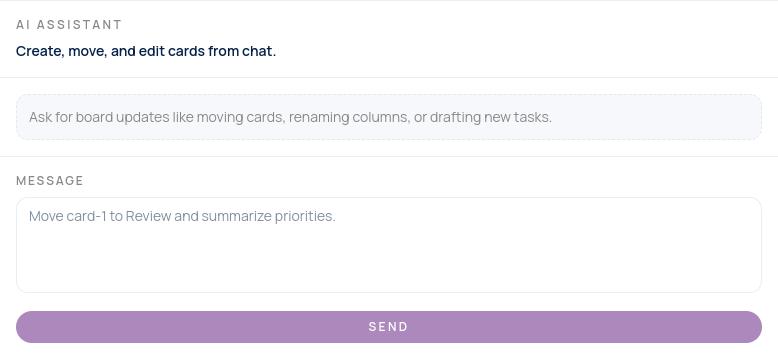

# Kanban Studio

Kanban Studio is a local-first project management MVP with:

- a Next.js Kanban UI
- a FastAPI backend
- SQLite persistence
- AI chat powered by OpenRouter (`openai/gpt-oss-120b:free`)

The app runs as a single Dockerized service and includes cross-platform start/stop scripts.

## Screenshots

### Login


### Board + AI sidebar


### AI sidebar


### Card layout


## MVP features

- Sign in with fixed credentials (`user` / `password`)
- One board per signed-in user
- Rename column titles
- Add, edit (inline title/details via board state), delete, and drag cards between columns
- AI chat sidebar that can:
  - answer in chat
  - optionally return a full validated board update that is persisted

## Tech stack

- Frontend: Next.js 16 + React 19 + Tailwind CSS
- Backend: FastAPI + Pydantic
- DB: SQLite (auto-create on startup)
- AI: OpenRouter chat completions
- Packaging/runtime: Docker
- Python package manager: `uv`

## Project structure

```text
backend/     FastAPI app, SQLite store, API tests
frontend/    Next.js app, unit tests, Playwright e2e tests
scripts/     start/stop scripts (Linux/macOS/Windows)
docs/        planning docs and screenshots
```

## Requirements

- Docker
- An OpenRouter API key in root `.env`:

```env
OPENROUTER_API_KEY=your_key_here
```

## Run with Docker

Linux:

```bash
./scripts/start-linux.sh
./scripts/stop-linux.sh
```

macOS:

```bash
./scripts/start-mac.sh
./scripts/stop-mac.sh
```

Windows (PowerShell):

```powershell
./scripts/start-windows.ps1
./scripts/stop-windows.ps1
```

The start scripts automatically pass root `.env` to the container when it exists.

Open: `http://localhost:8000`

## Default login

- Username: `user`
- Password: `password`

## API overview

- `GET /api/hello`
- `GET /api/board?username=user`
- `PUT /api/board?username=user`
- `POST /api/ai/connectivity`
- `POST /api/ai/chat?username=user`

### AI chat contract

Request body:

```json
{
  "message": "move card-1 to review",
  "board": { "columns": [], "cards": {} },
  "history": [{ "role": "user", "content": "..." }]
}
```

Response body:

```json
{
  "model": "openai/gpt-oss-120b:free",
  "assistantMessage": "Done.",
  "boardUpdated": true,
  "board": { "columns": [], "cards": {} }
}
```

If `boardUpdated` is `false`, `board` is `null`.

## Persistence

- SQLite path in container: `/data/pm.db`
- Docker volume: `pm-mvp-data`
- Data survives container restart

## Testing

Backend:

```bash
cd backend
uv run pytest -q
```

Frontend unit tests:

```bash
cd frontend
npm run test:unit
```

Frontend e2e tests:

```bash
cd frontend
npm run test:e2e
```

## Easy hosting

### Render (recommended)

This repo includes `render.yaml` for Blueprint deploy.

1. Push this repo to GitHub.
2. In Render: **New +** -> **Blueprint**.
3. Select this repo.
4. Set environment variable:
   - `OPENROUTER_API_KEY` = your OpenRouter key
5. Deploy.

`render.yaml` already configures:

- Docker build from `Dockerfile`
- Health check: `/api/hello`
- `DB_PATH=/tmp/pm.db` (free-tier compatible, ephemeral storage)

Note: Render free web services do not support persistent disks. Board data resets when the service restarts/sleeps.  
If you need persistence on Render, switch to a paid plan and mount a disk at `/data`, then set `DB_PATH=/data/pm.db`.

### Railway

This repo includes `railway.json` for Dockerfile-based deploy.

1. In Railway: **New Project** -> **Deploy from GitHub repo**.
2. Select this repo.
3. Add a Volume and mount it to `/data`.
4. Add environment variables:
   - `OPENROUTER_API_KEY` = your OpenRouter key
   - `DB_PATH` = `/data/pm.db`
5. Deploy.

After deploy, open your service URL and sign in with `user` / `password`.
