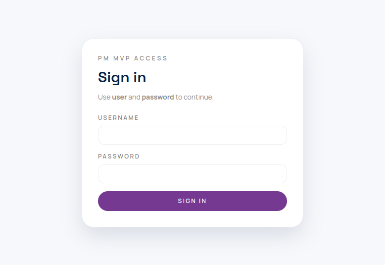
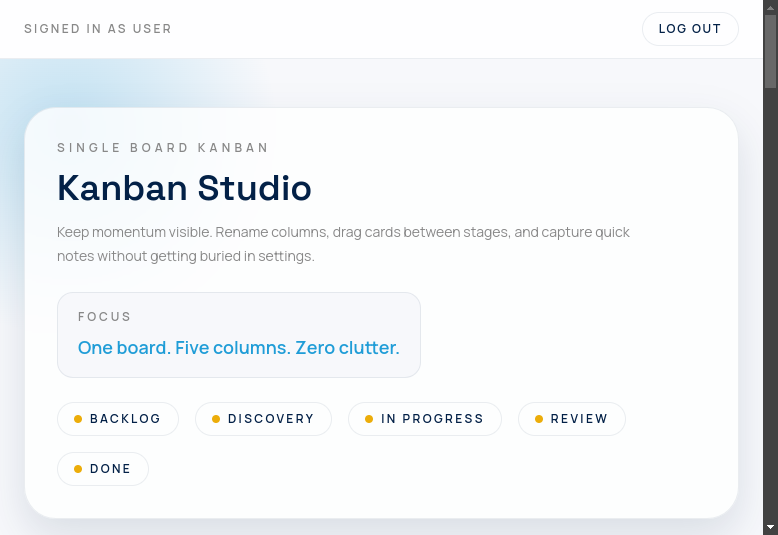
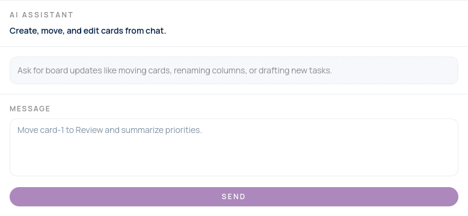

# Kanban Studio

A project management application with Kanban boards, multiple boards per user, and AI-powered assistance.

## Features

- **User Authentication** - Register and login with username/password
- **Multiple Boards** - Create, rename, and manage multiple Kanban boards
- **Drag & Drop** - Intuitive drag and drop cards between columns
- **AI Assistant** - Chat with AI to create, move, and edit cards
- **Responsive Design** - Works on desktop and mobile

## Tech Stack

- Frontend: Next.js 16 + React 19 + Tailwind CSS
- Backend: FastAPI + Pydantic
- DB: SQLite (auto-create on startup)
- AI: OpenRouter chat completions
- Packaging/runtime: Docker
- Python package manager: `uv`

## Screenshots

### Login/Register


### Board with multiple columns


### AI sidebar


### Card layout


## Requirements

- Docker
- An OpenRouter API key in root `.env`:

```env
OPENROUTER_API_KEY=your_key_here
```

## Run with Docker

Linux:

```bash
./scripts/start-linux.sh
./scripts/stop-linux.sh
```

macOS:

```bash
./scripts/start-mac.sh
./scripts/stop-mac.sh
```

Windows (PowerShell):

```powershell
./scripts/start-windows.ps1
./scripts/stop-windows.ps1
```

The start scripts automatically pass root `.env` to the container when it exists.

Open: `http://localhost:8000`

## First Time Setup

1. Open http://localhost:8000
2. Click "Create one" to register a new account
3. After registration, login with your credentials
4. Create new boards using the "+ New" button

## API Overview

### Authentication

- `POST /api/auth/register` - Register new user
- `POST /api/auth/login` - Login
- `POST /api/auth/logout` - Logout
- `GET /api/auth/me` - Get current user

### Boards

- `GET /api/boards` - List user's boards
- `POST /api/boards?name=...` - Create new board
- `PATCH /api/boards/{id}?name=...` - Rename board
- `DELETE /api/boards/{id}` - Delete board

### Kanban

- `GET /api/board/{id}` - Get board data
- `PUT /api/board/{id}` - Update board data

### AI

- `GET /api/ai/connectivity` - Check AI connection
- `POST /api/ai/chat` - Chat with AI (can update board)

### Legacy (backward compatible)

- `GET /api/board?username=user` - Get default board
- `PUT /api/board?username=user` - Update default board

## Testing

Backend:

```bash
cd backend
source .venv/bin/activate
pytest -q
```

Frontend unit tests:

```bash
cd frontend
npm run test:unit
```

## Project Structure

```
backend/     FastAPI app, SQLite store, API tests
frontend/   Next.js app, unit tests
scripts/    start/stop scripts (Linux/macOS/Windows)
docs/       planning docs and screenshots
```

## Persistence

- SQLite path in container: `/data/pm.db`
- Docker volume: `pm-mvp-data`
- Data survives container restart

## Easy Hosting

### Render (recommended)

This repo includes `render.yaml` for Blueprint deploy.

1. Push this repo to GitHub.
2. In Render: **New +** -> **Blueprint**.
3. Select this repo.
4. Set environment variable:
   - `OPENROUTER_API_KEY` = your OpenRouter key
5. Deploy.

`render.yaml` already configures:
- Docker build from `Dockerfile`
- Health check: `/api/hello`
- `DB_PATH=/tmp/pm.db` (free-tier compatible, ephemeral storage)

Note: Render free web services do not support persistent disks. Board data resets when the service restarts/sleeps.
If you need persistence on Render, switch to a paid plan and mount a disk at `/data`, then set `DB_PATH=/data/pm.db`.

### Railway

This repo includes `railway.json` for Dockerfile-based deploy.

1. In Railway: **New Project** -> **Deploy from GitHub repo**.
2. Select this repo.
3. Add a Volume and mount it to `/data`.
4. Add environment variables:
   - `OPENROUTER_API_KEY` = your OpenRouter key
   - `DB_PATH` = `/data/pm.db`
5. Deploy.

After deploy, open your service URL and create a new account.